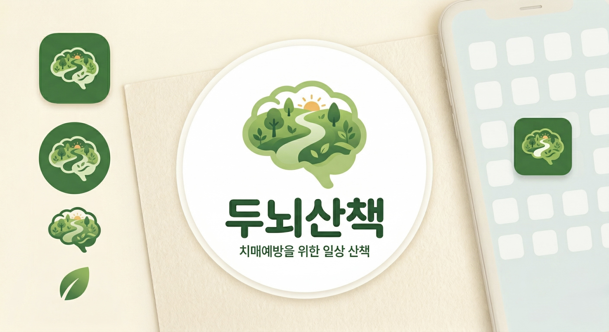
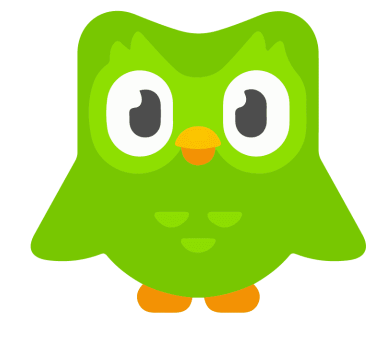
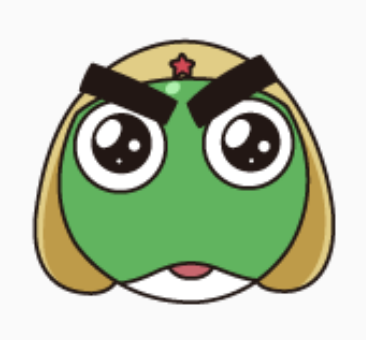
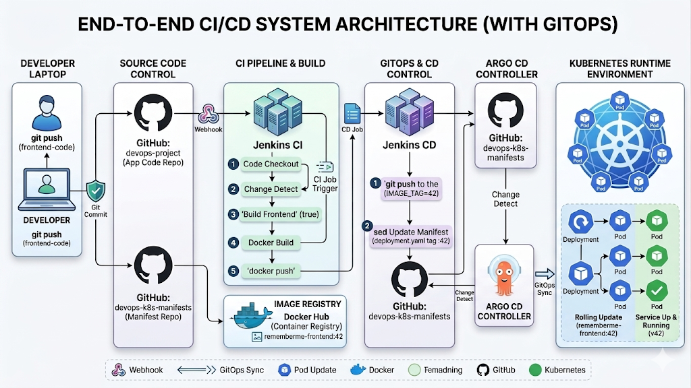

# 두뇌산책




## 👥 팀원 소개

<table style="width:100%; text-align:center;">
  <thead>
    <tr>
      <th>양준석</th>
      <th>박재하</th>
      <th>모희주</th>
      <th>윤준상</th>
      <th>이슬이</th>
      <th>조하은</th>
    </tr>
  </thead>
  <tbody>
    <tr>
      <td>
        <br>
        🔗 <a href="https://github.com/YJunSuk">YSunSuk</a>
      </td>
      <td>
        <br>
        🔗 <a href="https://github.com/horolo1234">horolo1234</a>
      </td>
      <td>
        <br>
        🔗 <a href="https://github.com/heejudy">heejudy</a>
      </td>
      <td>
        <br>
        🔗 <a href="https://github.com/wnstkd704">wnstkd704</a>
      </td>
      <td>
        <br>
        🔗 <a href="https://github.com/0lthree">0lthree</a>
      </td>
      <td>
        <br>
        🔗 <a href="https://github.com/haeuniiii">haeuniiii</a>
      </td>
    </tr>
  </tbody>
</table>

<br>


## 📍 목차

1. [프로젝트 개요](#1-프로젝트-개요)
2. [배경 및 필요성](#2-배경-및-필요성)
3. [기술 스택](#3-기술-스택)  
4. [시스템 아키텍처](#4-시스템-아키텍처)
5. [요구사항 정의서](#5-요구사항-정의서)
6. [테이블 정의서](#6-테이블-정의서)
7. [API 명세서](#7-API-명세서)
8. [백엔드 테스트 보고서](#8-백엔드-테스트-보고서)
9. [프론트엔드 테스트 보고서](#9-프론트엔드-테스트-보고서)
10. [CI/CD](#10-CI/CD)
11. [회고](#11-회고)

<br>


## <a id="1-프로젝트-개요"></a> 1. 프로젝트 개요  

본 프로젝트는 치매 예방을 목적으로 하는 웹사이트를 개발하는 것을 목표로 한다.


<br>

최근 인구 고령화가 빠르게 진행되면서 치매 환자 수 또한 지속적으로 증가하고 있으며, 이에 따라 개인과 사회가 부담해야 하는 경제적·사회적 비용 또한 점점 커지고 있다. 이러한 문제를 예방적인 관점에서 접근하기 위해, 사용자가 일상 속에서 간단한 두뇌 활동을 꾸준히 수행할 수 있도록 돕는 웹 기반 서비스를 기획하였다.

본 웹사이트는 사용자에게 매일 미션 3가지를 제공하여 지속적인 두뇌 활동을 유도한다. 제공되는 미션은 미니 게임, 개방형 질문, 하루 기록으로 구성되어 있으며, 각각의 활동을 통해 기억력과 사고력 등을 자극하고 자신의 일상생활을 돌아볼 수 있도록 설계하였다.

먼저 미니 게임은 문제의 지시사항을 읽고 그에 맞는 정답을 선택하는 방식으로 진행되며, 사용자가 간단한 문제 해결 과정을 통해 두뇌를 활용하도록 돕는다. 개방형 질문은 사용자가 단순한 단답형 답변이 아닌 자신의 과거 경험이나 기억을 떠올리며 서술하도록 유도하여 회상 능력과 사고 활동을 촉진한다. 마지막으로 하루 기록은 사용자가 자신의 하루를 돌아보며 오늘의 기분, 식사, 수면 등 생활 패턴을 기록하도록 하여 일상에 대한 인식과 자기 성찰의 시간을 갖는다.

이와 같은 기능을 통해 사용자가 일상 속에서 자연스럽게 두뇌 활동을 지속할 수 있도록 하여 치매 예방에 긍정적인 영향을 줄 수 있는 웹 서비스를 제공하고자 한다.

<br>


## <a id="2-배경-및-필요성"></a> 2. 배경 및 필요성

중앙치매센터[[1]](https://www.nid.or.kr/info/dataroom_view.aspx?bid=317)에 따르면, 전국 65세 이상 추정 치매 환자 수는 2019년 이후 매년 증가하는 추세를 보이며 2023년에는 약 87만 명으로 전년 대비 약 5.1% 증가한 것으로 나타났다.


<br>

치매 환자의 증가와 함께 경제적 부담 또한 큰 문제로 대두되고 있다. 치매 환자 1인당 연간 관리 비용은 연간 가구 소득의 약 43.8%에 해당하는 수준으로 나타나 개인과 가족에게 상당한 부담이 되고 있다. 향후 고령 인구의 증가와 함께 치매 환자 수 역시 지속적으로 증가할 것으로 예상되기 때문에, 치매를 치료하는 것뿐만 아니라 사전에 예방하는 것이 매우 중요하다.


<br>

치매 예방을 위해서는 낱말 맞추기, 글쓰기, 문화 및 취미 활동과 같이 뇌세포를 지속적으로 자극할 수 있는 두뇌 활동을 꾸준히 수행하는 것이 중요한 것으로 알려져 있다. 특히 이러한 활동을 즐겁고 지속적으로 수행하는 것이 장기적인 예방 효과에 긍정적인 영향을 줄 수 있다.

이에 본 프로젝트에서는 사용자가 일상생활 속에서 부담 없이 참여할 수 있는 웹 기반 치매 예방 서비스를 기획하였다. 사용자가 매일 간단한 미션을 수행하면서 지속적인 두뇌 활동을 유도하고 치매 예방에 도움을 줄 수 있는 환경을 제공하고자 한다.

<br>


## <a id="3-기술-스택"></a> 3. 기술 스택

### BACKEND


### FRONTEND


### DATABASE


### DEPLOYMENT


### FRAMEWORKS, PLATFORMS, LIBRAIRES


### DOCUMENTATION


### DEVOPS
    

<br>


## <a id="4-시스템-아키텍처"></a> 4. 시스템 아키텍처



<br>


## <a id="5-요구사항-정의서"></a> 5. 요구사항 정의서

<details>
<summary><b>🗒️ 요구사항 정의서 링크</b></summary>

- [요구사항 정의서](https://docs.google.com/spreadsheets/d/1cGxKolGeDWGtzUYxWShYSNCS0KK_gclYAco5hxDQDqI/edit?gid=1415182395#gid=1415182395)

</details>
<br>


## <a id="6-테이블-정의서"></a> 6. 테이블 정의서

<details>
<summary><b>🗄️ 테이블 정의서 링크</b></summary>

- [테이블 정의서](https://docs.google.com/spreadsheets/d/1W4umq2TJ3RlpNsyxd6Db3YlDfhOW4DBUH2VfQkSFBGc/edit?gid=0#gid=0)

</details>
<br>


## <a id="7-API-명세서"></a> 7. API 명세서

<details>
<summary><b>📋 API 명세서 링크</b></summary>

- [API 명세서](https://www.notion.so/API-308dd863c93280e2808fdca71cc4adde)

</details>
<br>


## <a id="8-백엔드-테스트-보고서"></a> 8. 백엔드 테스트 보고서

<details>
<summary><b>🧾 백엔드 테스트 보고서 링크</b></summary>

- [백엔드 테스트 보고서](https://docs.google.com/spreadsheets/d/1cGxKolGeDWGtzUYxWShYSNCS0KK_gclYAco5hxDQDqI/edit?gid=211938515#gid=211938515)

</details>
<br>


## <a id="9-프론트엔드-테스트-보고서"></a> 9. 프론트엔드 테스트 보고서

<details>
<summary><b>🧾 프론트엔드 테스트 보고서 링크</b></summary>

- [프론트엔드 테스트 보고서](https://docs.google.com/spreadsheets/d/1cGxKolGeDWGtzUYxWShYSNCS0KK_gclYAco5hxDQDqI/edit?gid=687771753#gid=687771753)

</details>
<br>


## <a id="10-CI/CD"></a> 10. CI/CD

### 📌 시나리오

#### 1. 코드 업데이트 (Git Push)
개발자가 수정한 코드를 GitHub develop 브랜치에 commit & push 하여 전체 자동화 프로세스를 트리거합니다.
<br>

#### 2. 이벤트 전달 (Webhook)
GitHub는 Webhook을 통해 실시간으로 변경 이벤트를 Jenkins 서버에 전달합니다.
<br>

#### 3. CI 단계: 빌드 및 이미지 업로드 (Jenkins)
변경 감지: Jenkins 파이프라인이 이전 커밋과 비교하여 백엔드/프론트엔드 변경 사항을 식별합니다.
Docker 빌드: 변경된 파트의 도커 이미지를 생성하고 Docker Hub에 업로드합니다.
설정 업데이트: deployment.yml 파일의 이미지 태그를 최신화하여 Manifest 저장소에 push 합니다.
<br>

#### 4. CD 단계: 자동 동기화 및 배포 (ArgoCD)
Git 감지: ArgoCD가 Git 저장소의 상태 변화를 자동으로 감지합니다.
무중단 배포: 백엔드와 프론트엔드 각각의 변경 사항을 쿠버네티스 클러스터에 무중단으로 반영합니다.
<br><br>


### ⚙️ 파이프라인 스크립트

<details>
<summary><b>Jenkins Pipeline</b></summary>

```groovy
pipeline {
    agent {
        kubernetes {
            yaml '''
            apiVersion: v1
            kind: Pod
            metadata:
              name: jenkins-agent
            spec:
              containers:
              - name: docker
                image: docker:29.4.1-cli-alpine3.23
                command:
                - cat
                tty: true
                volumeMounts:
                - mountPath: "/var/run/docker.sock"
                  name: docker-socket
              - name: maven
                image: maven:3.9.6-eclipse-temurin-21
                command:
                - cat
                tty: true
              volumes:
              - name: docker-socket
                hostPath:
                  path: "/var/run/docker.sock"
            '''
        }
    }

    triggers {
        githubPush() 
    }

    environment {
        DOCKER_CREDENTIALS_ID = 'dockerhub-access'
        DOCKER_REGISTRY = 'yjs0530'
        BACKEND_IMAGE = "${DOCKER_REGISTRY}/rememberme-backend"
        FRONTEND_IMAGE = "${DOCKER_REGISTRY}/rememberme-frontend"
        GITOPS_REPO = 'github.com/YJunSuk/devops-k8s-manifests.git'
        IMAGE_TAG = "${BUILD_NUMBER}"
    }

    stages {
        stage('Checkout') {
            steps {
                checkout scm
            }
        }

        stage('Detect Changes') {
            steps {
                script {
                    def changedFiles = sh(script: 'git diff --name-only HEAD~1', returnStdout: true).trim().split("\n")

                    echo "Changed files:\n${changedFiles.join('\n')}"
                    env.SHOULD_BUILD_FRONTEND = changedFiles.any { it.startsWith("devops-frontend/") } ? "true" : "false"
                    env.SHOULD_BUILD_BACKEND = changedFiles.any { it.startsWith("devops-backend/") } ? "true" : "false"
                    echo "SHOULD_BUILD_FRONTEND : ${env.SHOULD_BUILD_FRONTEND}"
                    echo "SHOULD_BUILD_BACKEND : ${env.SHOULD_BUILD_BACKEND}"
                }
            }
        }
        stage('Backend Build') {
            when {
                expression { return env.SHOULD_BUILD_BACKEND == "true" }
            }
            steps {
                container('maven') {
                    dir('devops-backend') {
                        sh 'mvn clean package -DskipTests -B'
                    }
                }
            }
        }
        stage('Docker Login') {
            when {
                expression { return env.SHOULD_BUILD_FRONTEND == "true" || env.SHOULD_BUILD_BACKEND == "true" }
            }
            steps {
                container('docker') {
                    sh 'docker logout'

                    withCredentials([usernamePassword(
                        credentialsId: DOCKER_CREDENTIALS_ID,
                        usernameVariable: 'DOCKER_USERNAME',
                        passwordVariable: 'DOCKER_PASSWORD'
                    )]) {
                        sh 'echo $DOCKER_PASSWORD | docker login -u $DOCKER_USERNAME --password-stdin'
                    }
                }
            }
        }
        stage('Docker Build & Push - Backend') {
            when {
                expression { return env.SHOULD_BUILD_BACKEND == "true" }
            }
            steps {
                container('docker') {
                    dir('devops-backend') {
                        sh "docker build --no-cache -t ${BACKEND_IMAGE}:${IMAGE_TAG} ."
                        sh "docker push ${BACKEND_IMAGE}:${IMAGE_TAG}"
                    }
                }
            }
        }
        stage('Docker Build & Push - Frontend') {
            when {
                expression { return env.SHOULD_BUILD_FRONTEND == "true" }
            }
            steps {
                container('docker') {
                    dir('devops-frontend') {
                        sh """
                            docker build --no-cache \
                                --build-arg VITE_KAKAO_CLIENT_ID=a3c925bb3ea42d42e7214bbed14cf347 \
                                --build-arg VITE_KAKAO_REDIRECT_URI=http://localhost:30180/kakao-auth \
                                --build-arg VITE_API_BASE_URL=/api/v1 \
                                -t ${FRONTEND_IMAGE}:${IMAGE_TAG} .
                        """
                        sh "docker push ${FRONTEND_IMAGE}:${IMAGE_TAG}"
                    }
                }
            }
        }
        stage('Trigger k8s-manifests') {
            steps {
                script {
                    build job: 'rememberme-k8s-manifests', 
                        parameters: [
                            string(name: 'IMAGE_TAG', value: "${IMAGE_TAG}"),
                            string(name: 'DID_BUILD_FRONTEND', value: "${env.SHOULD_BUILD_FRONTEND}"),
                            string(name: 'DID_BUILD_BACKEND', value: "${env.SHOULD_BUILD_BACKEND}")
                        ],
                        wait: true
                }
            }
        }
    }
}
```

</details>

<details>
<summary><b>k8s manifest Pipline</b></summary>

```groovy
pipeline {
    agent any

    parameters {
        string(name: 'IMAGE_TAG', defaultValue: '', description: 'Docker Image Version')
        string(name: 'DID_BUILD_FRONTEND', defaultValue: '', description: 'Did Build Frontend')
        string(name: 'DID_BUILD_BACKEND', defaultValue: '', description: 'Did Build Backend')
    }

    stages {
        stage('Checkout Main Branches') {
            steps {
                sh 'git checkout main'
                echo "IMAGE_TAG: ${params.IMAGE_TAG}"
                echo "DID_BUILD_FRONTEND: ${params.DID_BUILD_FRONTEND}"
                echo "DID_BUILD_BACKEND: ${params.DID_BUILD_BACKEND}"
            }
        }

        stage('update frontend deployment.yaml') {
            when {
                expression {
                    return params.DID_BUILD_FRONTEND == "true"
                }
            }
            steps {
                dir('rememberme-frontend') {
                    echo "Received Docker Image Version : ${params.IMAGE_TAG}"
                    sh "sed -i 's|yjs0530/rememberme-frontend:.*|yjs0530/rememberme-frontend:${params.IMAGE_TAG}|g' deployment.yaml"
                    sh 'cat deployment.yaml'
                }
            }
        }

        stage('update backend deployment.yaml') {
            when {
                expression {
                    return params.DID_BUILD_BACKEND == "true"
                }
            }
            steps {
                dir('rememberme-backend') {
                    echo "Received Docker Image Version : ${params.IMAGE_TAG}"
                    sh "sed -i 's|yjs0530/rememberme-backend:.*|yjs0530/rememberme-backend:${params.IMAGE_TAG}|g' deployment.yaml"
                    sh 'cat deployment.yaml'
                }
            }
        }

        stage('Commit & Push') {
            when {
                expression { 
                    return params.DID_BUILD_FRONTEND == "true" || params.DID_BUILD_BACKEND == "true"
                }
            }
            steps {
                sh 'git config --list'
                sh 'git config user.name "jenkins"'
                sh 'git config user.email "jenkins@beyond.com"'
                sh "git add ."
                sh "git commit -m 'Update RememberMe Image Version ${params.IMAGE_TAG}'"
                sh 'git status'

                sshagent(['github-k8s-manifests']) {
                    sh 'git push origin main'
                }
            }
        }
    }
}
```

</details>

<br>


### ✅ 실행 결과

<details>
<summary><b>📱 실행 결과 링크</b></summary>

- [실행 결과 링크](https://youtu.be/AMrLpmCyrm4)

</details>
<br>


## <a id="11-회고"></a> 11. 회고

|   이름   |     회고 내용     |
|-----------|-----------------|
|      양준석      |     준석님 작성     |
|      박재하      |     재하님 작성     |
|      모희주      |     희주님 작성     |
|      윤준상      |     준상님 작성     |
|      이슬이      |     슬이님 작성     |
|      조하은      |     하은님 작성     |
